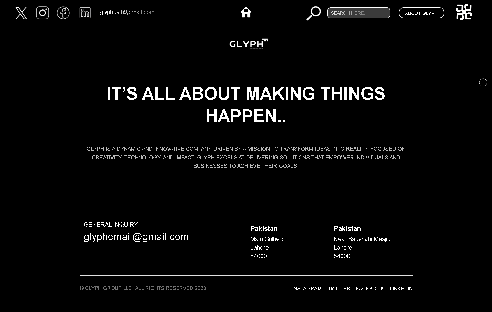
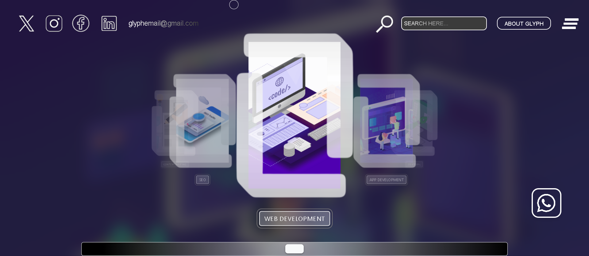
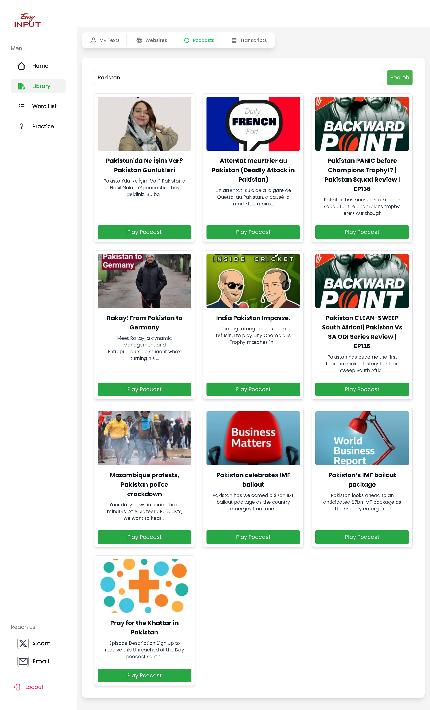
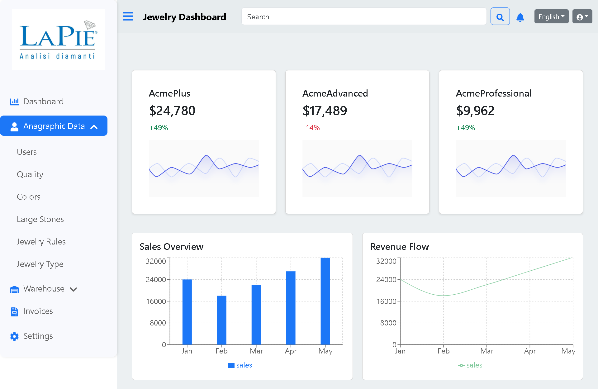
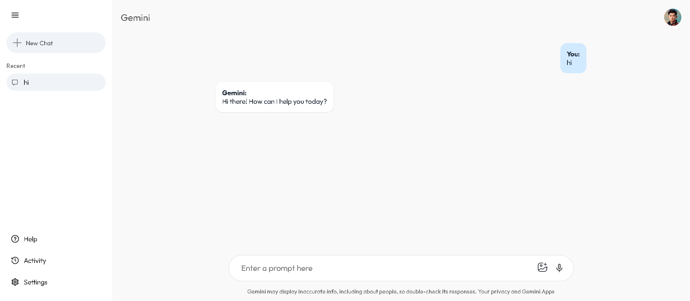

# Hi, I'm Engr.Muhammad Hammad Ashraf 👋

🎓 Software Engineering Graduate | ⚛️ React Developer | 🚀 Future Full-Stack Engineer

  

---

## 🛠️ Tech Skills

  
  
  
  
  
  
  
  

---

## 📸 My Work Showcase

  
  

  
  
  

  

---

## 📊 GitHub Stats

  
  

---

## 📈 Contribution Graph

  

---

## 👀 Visitors Count

  

---

## 🌱 Currently Learning

- Full-Stack Development (Node.js, Express.js, MongoDB)
- Advanced React & Performance Optimization

---

## 👨‍💻 About Me

- 🎓 Graduated in **Software Engineering**
- 💻 Building projects daily to sharpen my **React & Web Development** skills
- 🌍 Open to collaborations on **React projects**
- 📫 Reach me at: **hammadchoudharyy@gmail.com**

---

⭐ _Always learning, always building!_
